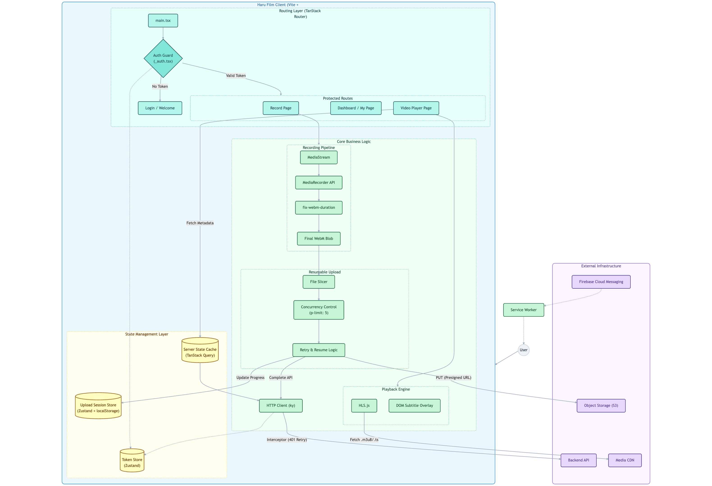

# 하루 필름 (Frontend)


**Haru Film**은 일상의 소중한 순간들을 매일 기록하고 공유하는 **영상 일기 스트리밍 플랫폼**의 프론트엔드 Repository입니다.

React 19를 활용하여 브라우저 내 영상 녹화, 대용량 파일의 안정적인 업로드, 그리고 끊김 없는 스트리밍 경험을 제공하는 데 초점을 맞췄습니다.

## 🛠️ Tech Stack


## 🏁 Getting Started

### Requirements

- Node.js v20 이상
- pnpm v9 이상

### Environment Setup

프로젝트 루트에 `.env` 파일을 생성하고 환경 변수를 설정해주세요. (`.env.example` 참고)

### Installation & Run

```bash
# 의존성 설치
pnpm install

# 개발 서버 실행
pnpm dev

# 프로덕션 빌드 및 미리보기
pnpm build
pnpm preview
```

## 🏗️ 프로젝트 구조

TanStack Router를 활용한 파일 기반 라우팅 구조입니다. 특정 라우트에서만 사용되는 컴포넌트는 해당 라우트 폴더 내에 위치시켜 관리합니다.

```text
src/
├── api/                # API 클라이언트 (ky + Zod)
├── components/         # 전역 공통 컴포넌트
├── hooks/              # 커스텀 훅 (useCamera, useUpload 등)
├── lib/                # 유틸리티 (Request Handler, Utils)
├── routes/             # TanStack Router 파일 기반 라우팅
│   ├── _auth/          # 인증이 필요한 라우트
│   │   └── record/     # 녹화 관련 페이지 및 지역 컴포넌트
│   └── _public/        # 공개 라우트
├── stores/             # 전역 상태 관리 (Zustand)
└── types/              # TypeScript 타입 정의
```

### Architecture Flow



## 🧰 기술적 특징

<details>
<summary><h3>1. 대용량 영상 업로드의 안정성 확보 (Resumable Upload)</h3></summary>

모바일 환경 등 불안정한 환경에서도 고화질의 영상을 업로드하기 위해 Resumable Upload 방식을 도입했습니다.

- **Chunk 분할 전송**: `File.slice()`를 이용해 정해진 크기로 쪼개어 병렬 처리

- **Resumable**: 업로드 상황을 `localStorage`에 저장해 중단된 지점부터 재개 가능

- **동시성 제어**: `p-limit` 라이브러리를 활용해 브라우저 리소스 관리 및 서버 부하 최소화

- **파일 메타데이터 주입**: 업로드 전 `fix-webm-duration` 라이브러리를 사용해 WebM 파일의 누락된 duration 메타데이터를 보완

> **📈 성능 개선**: 네트워크 단절 시 전송 성공률 **0% → 100%** 달성 (하단 벤치마크 참조)

</details>

<details>
<summary><h3>2. HLS 기반의 ABR(Adaptive Bitrate Streaming)</h3></summary>

HLS 프로토콜을 활용해 다양한 네트워크 환경에서 끊김 없는 영상 재생 경험을 제공합니다.

- **HLS.js 동적 사용**: 브라우저의 네이티브 HLS 지원 여부에 따라 HLS.js를 동적으로 로드

- **커스텀 플레이어**: "화질 선택", "자막 표기" 등의 기능을 갖춘 맞춤형 비디오 플레이어 구현

> **📈 성능 개선**: 버퍼링 **Zero** 달성, 탐색 시간 **58.8% 단축** (하단 벤치마크 참조)

</details>

<details>
<summary><h3>3. 클라이언트의 부하를 최소화한 자막 처리</h3></summary>

초기 시스템에서는 영상에서 "어떤 질문에 답변하고 있는지"를 확인할 수 없었습니다. 이를 해결하기 위해 영상 내에 자막을 합성하는 방식을 고려했습니다.

- **문제점**: `canvas.captureStream()`을 사용해 프레임마다 텍스트를 그리는 방식은 브라우저가 GPU 가속(VPU)을 사용하지 못하고 CPU 인코딩을 강제하여 심각한 성능 저하를 유발했습니다.

- **결정**: 합성 없이 하드웨어 가속을 최대한 활용해 녹화하되, 질문별 타임스탬프를 별도로 기록, 재생시 `ontimeupdate`를 활용해 자막을 오버레이 하는 방식으로 성능과 유연성(자막 On/Off 등)을 확보했습니다.

> **📈 성능 개선**: 녹화 FPS **3.8배 향상** (30.8 → 119.7) (하단 벤치마크 참조)

</details>

<details>
<summary><h3>4. Zod를 활용한 런타임 타입 안전성 체크</h3></summary>

TypeScript의 정적 타입 검사로는 보장할 수 없는 런타임 환경에서의 데이터 무결성을 Zod를 통해 확보합니다.

- **API 응답 검증**: 모든 API 요청 및 응답에 대해 검증 수행, 예상치 못한 데이터 구조 변경에 대응 가능

- **환경 변수 검증**: 애플리케이션 시작 시점에 필수 환경 변수의 존재 및 형식 검증

</details>

<details>
<summary><h3>5. React Compiler를 통한 성능 최적화</h3></summary>

React 19의 React Compiler를 도입해 Memoization보다는 핵심 로직에 집중하면서도 렌더링 성능을 극대화했습니다.

그러나 [Rules of Hooks](https://react.dev/reference/rules/rules-of-hooks)를 준수하였음에도 Custom Hook - Context - Component로 이어지는 구조에서 원하는 만큼의 메모이제이션을 수행하지 못함을 확인했습니다.

따라서 **명시적으로 리렌더링 이슈가 발생하는 Custom Hook 내부에 한해 메모이제이션을 적용하고, 이 외에는 React Compiler에 맡기는 하이브리드 방식을 채택했습니다.**

</details>

<details>
<summary><h3>6. TanStack Router 기반의 명확한 라우팅</h3></summary>

서비스 특성상 **로그인 전(Landing, Login)** 과 **로그인 후(Dashboard, Record)** 의 UI 레이아웃과 접근 권한이 완전히 분리되어야 했습니다. 이를 위해 TanStack Router의 **File-Based Routing**과 **Layout Route** 기능을 적극 활용했습니다.

- **레이아웃의 물리적 분리**: `_public` (비회원)과 `_auth` (회원) 디렉토리를 통해 라우트 그룹을 형성했습니다. 각 그룹은 독립적인 Layout 컴포넌트를 가지며, 이를 통해 불필요한 조건부 렌더링 없이 깔끔하게 UI 구조를 분리했습니다.

- **중앙화된 Auth Guard**: `_auth` 라우트의 `beforeLoad` 훅을 활용하여, 하위의 모든 페이지 진입 시 토큰 존재 여부를 검사하고 리다이렉트 처리하는 로직을 중앙에서 관리합니다.

</details>

<details>
<summary><h3>7. 푸시 알림을 위한 환경 설정의 동적 주입</h3></summary>

FCM 푸시 알림을 위한 Service Worker 파일(`firebase-messaging-sw.js`)은 빌드 시점에 환경 변수를 주입할 수 없기 때문에, 애플리케이션 초기화 시점에 동적으로 설정 값을 주입하는 방식을 채택했습니다.

이를 통해 React 내부와 외부에 동일 정보가 이중으로 관리되는 문제를 해결하고, 일관된 동작을 보장합니다.

</details>

<details>
<summary><h3>8. 상황에 맞는 상태 관리 전략</h3></summary>

Access Token 등 전역적 접근이 필수적인 상태는 Zustand로, API 데이터 캐싱 등 서버 상태는 TanStack Query로, 녹화 프로세스 등 특정 컴포넌트 트리 내에서만 필요한 상태는 Context로 관리하는 등 상황에 맞는 상태 관리 전략을 채택했습니다.

</details>

<details>
<summary><h3>9. 선언적인 비동기 상태 처리와 부분적 에러 격리</h3></summary>

데이터 로딩 중(`Loading`)이거나 실패(`Error`)했을 때, 전체 페이지를 Blocking하는 대신 필요한 부분만 상태를 보여주는 것이 UX 측면에서 중요했습니다.

- **FallbackBoundary 구현**: React의 `Suspense`와 `ErrorBoundary`, 그리고 TanStack Query의 `QueryErrorResetBoundary`를 조합한 컴포넌트를 구현했습니다.

- **선언적 처리**: 컴포넌트 내부에서 `if (isLoading) ...`과 같이 명령형으로 분기 처리하는 대신, 상위에서 선언적으로 비동기 상태를 관리하여 비즈니스 로직과 UI 로직을 분리했습니다.

- **Partial Fallback**: 페이지 전체가 아닌 **특정 섹션 단위로 로딩 스켈레톤이나 에러 재시도 UI를 노출**하여, 일부 데이터 로드 실패가 전체 앱의 사용성을 해치지 않도록 에러를 격리했습니다.

</details>

## 🧩 라이브러리 사용

| 카테고리              | 라이브러리                     | 설명                                                                     |
| --------------------- | ------------------------------ | ------------------------------------------------------------------------ |
| **라우팅 & 상태관리** | TanStack Router                | 타입 안전성을 보장하는 파일 기반 라우팅                                  |
|                       | TanStack Query                 | 서버 상태 관리(Caching, Refetching 등) 및 비동기 처리                    |
|                       | Zustand                        | 간결한 전역 상태 관리                                                    |
| **HTTP & 검증**       | ky                             | Fetch API 기반 HTTP 클라이언트                                           |
|                       | Zod                            | 런타임 스키마 검증 및 TypeScript 타입 자동 추론 (환경변수, API 응답 등)  |
| **미디어 처리**       | fix-webm-duration              | MediaRecorder로 녹화한 WebM 파일에 누락된 duration(길이) 메타데이터 주입 |
|                       | hls.js                         | HLS 프로토콜 비디오 재생 지원                                            |
| **유틸리티 & 에러**   | p-limit                        | 비동기 작업의 동시 실행 개수 제한 (병목 현상 방지)                       |
|                       | react-error-boundary           | 런타임 에러를 선언적으로 포착하고 Fallback UI를 표시                     |
| **UI & 스타일링**     | Tailwind CSS                   | 유틸리티 클래스 기반 CSS 프레임워크 (v4)                                 |
|                       | class-variance-authority (CVA) | UI 컴포넌트의 Variant(크기, 색상 등) 상태를 직관적으로 관리              |
|                       | Sonner                         | 토스트(Toast) 알림                                                       |
| **테스트**            | playwright                     | End-to-End 테스트 및 성능 벤치마크 자동화                                |
| **개발 도구**         | React Compiler                 | React 19의 자동 메모이제이션 컴파일러                                    |
|                       | @lukemorales/query-key-factory | React Query의 쿼리 키를 체계적이고 타입 안전하게 관리                    |

## ⚡ 성능 벤치마크

Playwright와 Chrome DevTools Protocol(CDP)을 활용하여 실제 브라우저 환경에서 정량적인 성능 지표를 측정했습니다.
단순한 기능 동작 확인을 넘어, **저사양 기기와 불안정한 네트워크 환경(Network Throttling)** 에서의 사용자 경험(QoE)을 검증하는 데 주력했습니다.

### 테스트 환경

객관적인 데이터 수집을 위해 하드웨어 리소스 및 네트워크 대역폭을 통제했습니다.

| 항목        | 설정값 (Configuration)      | 목적                                     |
| ----------- | --------------------------- | ---------------------------------------- |
| **Network** | Fast 4G / Slow 4G / Offline | 불안정한 모바일 네트워크 환경 시뮬레이션 |
| **CPU**     | 8x Throttling               | 보급형 모바일 기기의 처리 성능 모사      |
| **Host**    | Apple M1 Pro / 16GB RAM     | 테스트 실행 호스트 (N=10회 반복 측정)    |

### 테스트 결과

위 **기술적 특징(1~3번)** 에서 언급된 성능 개선 효과에 대한 벤치마크 결과입니다.

#### 1. 업로드 (Upload): Fault Tolerance

업로드 중 네트워크가 10초간 차단되는 상황에서의 복구 능력을 검증했습니다.

| 구분            | Resumable (New)    | Batch (Legacy) | 결과                               |
| :-------------- | :----------------- | :------------- | :--------------------------------- |
| **전송 성공률** | **100% (Success)** | 0% (Fail)      | 네트워크 단절 시에도 **복구 가능** |
| **데이터 보존** | **완전 보존**      | 유실 발생      | 패킷 손실 없음                     |

#### 2. 재생 (Playback): 적응형 스트리밍(ABR) 효율

Slow 4G 환경에서 MP4 다운로드 방식과 HLS 스트리밍 방식을 비교했습니다.

| 측정 지표       | HLS (New) | MP4 (Legacy) | 개선율                  |
| :-------------- | :-------- | :----------- | :---------------------- |
| **버퍼링**      | **0.0ms** | 395.8ms      | **Zero Buffering** 달성 |
| **탐색 시간**   | **2.6s**  | 6.5s         | **58.8% 단축**          |
| **데이터 소모** | **9.9MB** | 17.3MB       | **42.5% 절감**          |

#### 3. 녹화 (Recording): 렌더링 파이프라인 최적화

Canvas에 자막을 직접 그리는(Burning) 방식에서 **DOM Overlay** 방식으로 변경하여 렌더링 병목을 해소했습니다.

| 측정 지표    | DOM Overlay (New) | Canvas (Legacy) | 개선율         |
| :----------- | :---------------- | :-------------- | :------------- |
| **FPS**      | **119.7**         | 30.8            | **3.8배 향상** |
| **CPU 효율** | **23.47 (FPS/%)** | 6.04 (FPS/%)    | **288% 증가**  |

### How to Run Benchmark

> 주의: 벤치마크 테스트는 **Network Throttling과 CPU Throttling을 사용해 실행 시간이 오래 걸립니다.** CI/CD 파이프라인에 포함하기에는 부적합합니다.

```bash
# 인증 정보 설정
# 브라우저가 열리면 구글 로그인 후 auth.json 파일이 생성됩니다. 이후 브라우저를 닫아주세요.
# Refresh Token 만료 전까지 재사용 가능합니다.
# (구글 로그인 정책으로 인해 실패시 수동 생성이 필요할 수 있습니다.)
pnpm auth

# 벤치마크 테스트 실행
pnpm test
```
